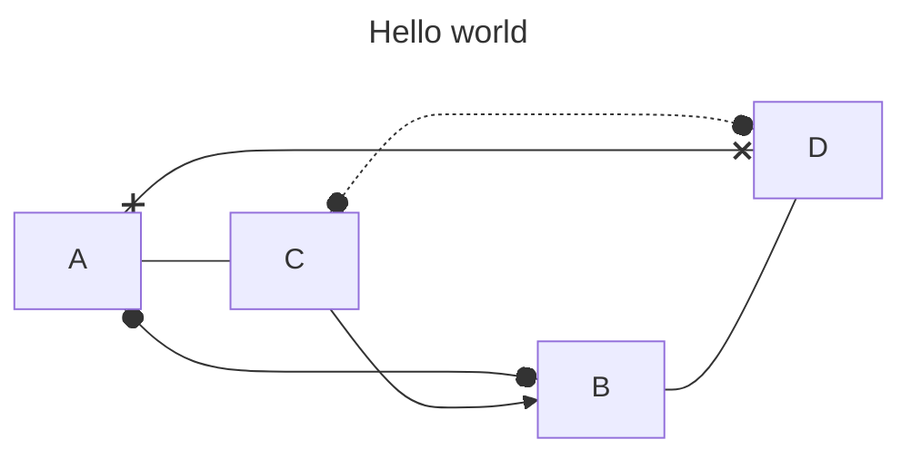

# Tic-Tac-Toe Game

### Plan

1. Create HTML file, why? for skeletal structure
2. Design using CSS (Don't go deeply:( )
3. Write logic using JS (Main part)

```mermaid
---
title: Hello world
---
graph LR
	A o---o B
	C o-..-o D
    A x---x D
    C ---> B
    A --- C
    B --- D
```

